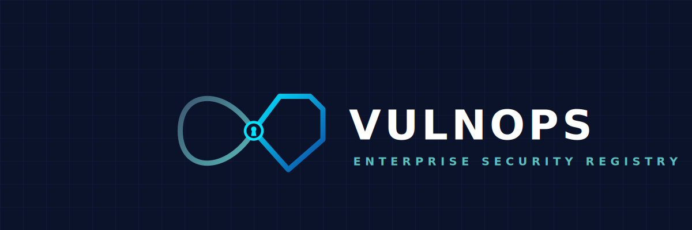

<p align="center">
  
</p>

# VulnOps

A CVE registry for tracking and managing vulnerabilities, built as a full-stack DevSecOps project. The application runs on AWS EKS and is deployed through a GitHub Actions CI/CD pipeline with security tooling integrated at every stage.

**Stack:** React + Nginx / Node.js Express / PostgreSQL  
**Infrastructure:** AWS EKS (Auto Mode) / Terraform / Docker / Kubernetes

---

## What it does

VulnOps lets teams submit CVEs with an ID, severity, affected product, CVSS score, description, and remediation status. Each entry supports threaded notes. There is a live CVSS v3.1 calculator on the submission form built on the official FIRST formula.

The application is deliberately simple. The security architecture around it is not: hardened containers, a locked-down Kubernetes deployment, a 10-stage CI pipeline, and AWS account-level monitoring, all provisioned through code.

<p align="center">
  
</p>
<br>
<p align="center">
  
</p>

The submission form includes a live CVSS v3.1 calculator built on the official FIRST formula. Scores update in real time as attack vector, complexity, privileges, and impact metrics are selected.

---

## Architecture

```
Internet -> AWS NLB -> nginx (port 8080, non-root)
                    -> React SPA (static assets)
                    -> Express API (port 5000, ClusterIP) -> PostgreSQL (port 5432, ClusterIP)
```

The backend and database are ClusterIP services with no external load balancer and no public endpoint. Only the frontend NLB is internet-facing. All three tiers run in Kubernetes on EKS. Cluster nodes sit in private subnets with a NAT gateway for outbound traffic only.

---

## Infrastructure

Provisioned entirely with Terraform using official AWS modules.

**VPC:** Three availability zones. EKS nodes in private subnets. Public subnets hold only the NAT gateway and the NLB.

**EKS Auto Mode (Kubernetes 1.32):** AWS manages node groups, CoreDNS, and kube-proxy. All five control plane log types are enabled (api, audit, authenticator, controllerManager, scheduler). Kubernetes secrets are encrypted at rest using AWS KMS envelope encryption.

**Terraform state:** S3 backend with AES256 encryption and versioning. DynamoDB table for state locking to prevent concurrent apply races.

**AWS security monitoring:**

- CloudTrail: multi-region trail with log file validation. SHA-256 digest files are generated per delivery, so any deleted or modified log breaks the chain. `include_global_service_events` is enabled because IAM and STS events always log to us-east-1 regardless of where your resources are.
- VPC Flow Logs: captures all traffic (ACCEPT and REJECT) and ships to S3. A custom log format adds pre-NAT source addresses, TCP flags, subnet ID, and VPC ID for forensic reconstruction. S3 delivery has no ingestion cost; CloudWatch Logs charges $0.50/GB.
- IAM Access Analyzer (account scope): continuously evaluates resource-based policies and flags anything accessible from outside the AWS account.
- Security logs bucket: public access fully blocked, AES256 encryption, versioning enabled, 30-day transition to STANDARD_IA, 90-day expiration.

---

## Containers

Both images use multi-stage builds: Alpine base, non-root user (UID 1000), production dependencies only.

The nginx production image is pinned to a SHA256 digest rather than a tag. Tags are mutable. A compromised upstream image under the same tag would be pulled silently. A digest is a cryptographic commitment to exact bytes.

The backend build stage intentionally uses an unpinned `node:20-alpine` to carry known CVEs. This gives the Trivy gate in CI something to detect, demonstrating that the gate actually works before the base image is upgraded.

---

## Kubernetes hardening

Every pod spec includes a full securityContext:

```yaml
securityContext:
  runAsNonRoot: true
  runAsUser: 1000
  runAsGroup: 1000
  seccompProfile:
    type: RuntimeDefault
  allowPrivilegeEscalation: false
  readOnlyRootFilesystem: true
  capabilities:
    drop: [ALL]
automountServiceAccountToken: false
```

None of the pods need Kubernetes API access. Disabling `automountServiceAccountToken` removes an auto-mounted credential from every pod that has no use for it.

NetworkPolicies start with a default-deny baseline. Explicit allows cover only the required paths: frontend to backend on port 5000, backend to PostgreSQL on port 5432. Everything else is blocked at the network layer, including any lateral movement from a compromised frontend pod toward the database.

The `vulnops` namespace enforces Pod Security Standards at `baseline` with audit and warn set to `restricted`. The namespace is not fully restricted because PostgreSQL `initdb` requires `CAP_CHOWN` to set ownership on its data directory. Frontend and backend pods enforce restricted-equivalent controls through their own securityContexts regardless.

ArgoCD runs inside EKS and watches the `k8s/` directory in this repository. `selfHeal: true` means any manual `kubectl apply` drift is automatically reverted. CI never holds cluster credentials.

---

## CI/CD pipeline

10 stages, triggered on every push and pull request to `main`.

| Stage | Tool | What it does |
|---|---|---|
| Secret scan | Gitleaks | Full git history scan for credentials and tokens. Runs first. No point building if secrets are already exposed. |
| Lint | ESLint | Backend and frontend in parallel. |
| Dependency audit | npm audit | Fails on CRITICAL severity findings in third-party packages. |
| SAST source scan | Semgrep | Scans `backend/src/` and `frontend/src/` with `p/nodejs`, `p/owasp-top-ten`, and `p/javascript`. Results uploaded to the GitHub Security tab as SARIF. |
| SAST gate test | Semgrep | Runs `--error` against a fixture of intentionally insecure code. Inverted exit code: if Semgrep finds nothing in the fixture, the build fails. This validates the ruleset fires. A scanner that runs silently and catches nothing is worse than no scanner. |
| Build + push | Docker Buildx / GHCR | Images tagged with the 7-character commit SHA. `GITHUB_TOKEN` for auth, no stored PATs. SBOM and build provenance attestations are attached automatically via BuildKit. |
| Image scan | Trivy | Scans for OS and library CVEs across both images. |
| IaC scan | Checkov | Scans `terraform/` and `k8s/` manifests for misconfigurations. |
| Dockerfile lint | Hadolint | Fails on errors, warns on warnings. |
| Manifest update | git | Updates image tags in the backend and frontend deployment manifests. ArgoCD picks up the commit and deploys. |

Every running image is traceable to the exact commit that built it. `latest` is mutable and leaves no audit trail.

---

## Security decisions

| Decision | Rationale |
|---|---|
| `npm install --ignore-scripts` | Blocks postinstall-based supply chain attacks. Axios 1.14.1 and 0.30.4 (April 2025) were compromised to drop a RAT via the `postinstall` hook. This blocks that class of attack at install time. |
| EKS nodes in private subnets | Nodes are not directly internet-reachable. NAT gateway handles outbound only. Reduces the blast radius of a compromised node. |
| Terraform state in S3 + DynamoDB | Encrypted at rest, versioned (rollback if state is corrupted), locked against concurrent writes. |
| Nginx pinned to SHA256 digest | Image tags are mutable. Digest guarantees byte-for-byte identity regardless of what gets pushed upstream. |
| `drop: [ALL]` capabilities | Zero Linux capabilities on frontend and backend pods. Limits post-RCE impact by removing raw socket access and privilege escalation paths. |
| `readOnlyRootFilesystem: true` | Prevents writing webshells, tools, or malicious scripts to the container filesystem after compromise. |
| Default-deny NetworkPolicy | All pod-to-pod traffic is blocked by default. A compromised frontend pod cannot reach the database directly. |
| `automountServiceAccountToken: false` | Removes an auto-mounted Kubernetes API credential from every pod that does not need it. |
| GHCR over Docker Hub | CI uses the built-in `GITHUB_TOKEN`. No stored PATs, no third-party registry dependency. |
| SHA tag over `latest` | Ties every running pod to the exact commit that built it. Full traceability from cluster state back to source. |
| ArgoCD GitOps | CI never holds cluster credentials. `selfHeal` enforces git as the only write path to production. Manual drift is reverted automatically. |
| SBOM + provenance on every image | Attached automatically by BuildKit. Documents what is in the image and where it was built, satisfying SLSA and EO 14028 intent. |
| Semgrep over CodeQL for SAST | The app is simple CRUD. CodeQL taint tracking is disproportionate overhead for this codebase. Semgrep pattern rules cover the Express/Node.js attack surface and each finding maps directly to a readable rule. |
| Semgrep gate test (inverted exit code) | Semgrep exits 0 by default even when it finds vulnerabilities. The `--error` flag changes that behavior. The gate test ensures the ruleset is not silently broken or misconfigured. |
| CloudTrail multi-region + log file validation | IAM and STS events log to us-east-1 regardless of the region your resources are in. Multi-region trail captures them. SHA-256 digest chain makes deleted or modified logs detectable after the fact. |
| VPC Flow Logs to S3 | Same data as CloudWatch Logs, no ingestion cost. Custom format adds pre-NAT source addresses and TCP flags for forensic reconstruction of traffic patterns. |
| IAM Access Analyzer | Continuously flags resources with policies that grant access from outside the AWS account. Catches misconfigured policies before they become incidents. |
| Baseline PSS for postgres only | PostgreSQL `initdb` requires `CAP_CHOWN`. Frontend and backend enforce restricted-equivalent controls through their own pod specs. |

---

## Running locally

**With Docker Compose:**

```bash
docker compose up --build
```

Frontend at `http://localhost`. API at `http://localhost:5000`. Database tables are created automatically on first start.

```bash
# Tear down and remove volumes
docker compose down -v
```

**Without Docker** (Node.js 20+ and PostgreSQL required):

```bash
# Create the database
sudo -u postgres psql <<EOF
CREATE USER vulnops WITH PASSWORD 'vulnops';
CREATE DATABASE vulnops OWNER vulnops;
GRANT ALL PRIVILEGES ON DATABASE vulnops TO vulnops;
\c vulnops
GRANT ALL ON SCHEMA public TO vulnops;
EOF

# Start frontend and backend together
npm install
npm run dev
```

Frontend at `http://localhost:5173`. API at `http://localhost:5000`.

---

## Deploying to AWS (EKS)

**Prerequisites:** AWS CLI configured with appropriate IAM permissions, Terraform >= 1.5, kubectl, Helm 3.

**1. Provision infrastructure:**

```bash
cd terraform
terraform init
terraform apply
```

**2. Configure kubectl:**

```bash
aws eks update-kubeconfig --region us-east-1 --name vulnops-eks
```

**3. Install ArgoCD:**

```bash
kubectl create namespace argocd
kubectl apply -n argocd -f https://raw.githubusercontent.com/argoproj/argo-cd/stable/manifests/install.yaml

# Wait for ArgoCD to be ready
kubectl wait --for=condition=available --timeout=120s deployment/argocd-server -n argocd
```

**4. Create the database secret:**

```bash
cp k8s/secrets.yaml.example k8s/secrets.yaml
# Edit k8s/secrets.yaml with base64-encoded credentials, then:
kubectl apply -f k8s/secrets.yaml
```

**5. Apply the ArgoCD application:**

```bash
kubectl apply -f k8s/argocd/application.yaml
```

ArgoCD syncs the `k8s/` directory and deploys all three tiers. From this point forward, any push to `main` that updates the image tags in the manifests triggers a deployment automatically.

**6. Get the frontend URL:**

```bash
kubectl get svc -n vulnops vulnops-frontend -o jsonpath='{.status.loadBalancer.ingress[0].hostname}'
```

---

## Tearing down

**Remove the application and namespace:**

```bash
kubectl delete -f k8s/argocd/application.yaml
kubectl delete namespace vulnops
```

**Remove ArgoCD:**

```bash
kubectl delete namespace argocd
```

**Destroy all AWS infrastructure:**

```bash
cd terraform
terraform destroy
```

This removes the EKS cluster, VPC, NAT gateway, S3 buckets (including the security logs bucket), CloudTrail trail, VPC Flow Logs, IAM Access Analyzer, and the DynamoDB state lock table.

---

## Repository structure

```
VulnOps/
├── backend/              # Express API and database schema
├── frontend/             # React + Vite + nginx.conf
├── k8s/
│   ├── namespace.yaml
│   ├── secrets.yaml.example
│   ├── postgres/
│   ├── backend/
│   ├── frontend/
│   ├── network-policies/
│   └── argocd/
├── terraform/            # VPC, EKS cluster, and security monitoring
├── .github/workflows/    # GitHub Actions CI pipeline
├── deploy/               # EC2 setup script for manual deployment
└── docker-compose.yml
```
